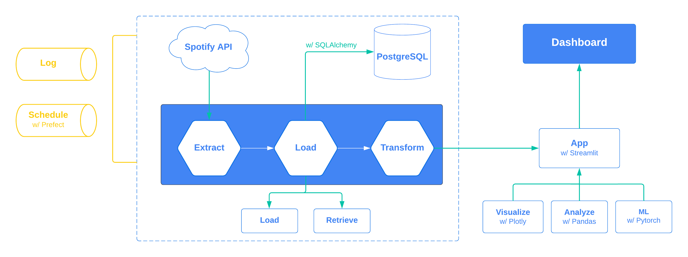

# Echodb - A tiny elt system

**Update** (15 December 2022): View the web application here at [Resonance](https://resonance.streamlit.app/)

## About the project

Echodb is a tiny system for collecting and scheduling music data pipeline from [Spotify](https://engineering.atspotify.com/). In short, it allows you to:

* Collect playlist such as `Discovery Weekly`, `Release Radar` (or even custom events of your choosing).
* Store the data in a scalable database w/ [Postgresql](https://www.postgresql.org/) and [SQLAlchemy](https://www.sqlalchemy.org/).
* Leverage a wide range of tools to model and analyze the behavioral data.
* Generate reports and deploy online dashboard for easy management.

---

## Echodb Datastack 101

<!-- * Utilizing a scalable database system, employing **[Postgresql](https://www.postgresql.org/)** as the storage engine, coupled with **[SQLAlchemy](https://www.sqlalchemy.org/)** as the Object-Relational Mapping (ORM) framework. -->